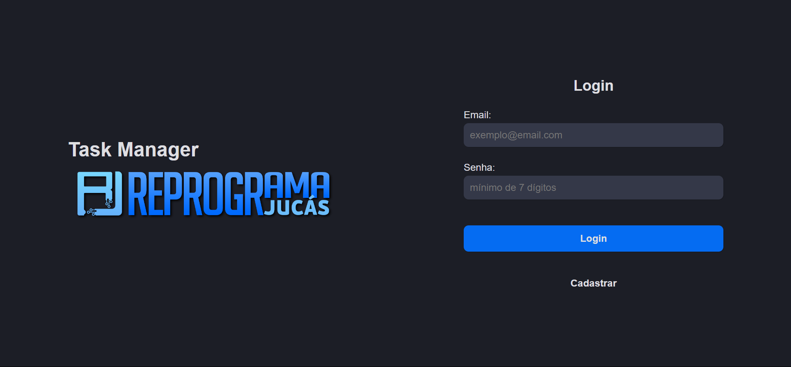

# Task Manager



The Task Manager is a `Full-Stack` Web Application developed as a final project of `Reprograma Jucás` [Web Development Course](https://emanuelquintino.github.io/Page-WDC/). This application allows the user to organize their tasks, offering management and monitoring capabilities for their activities.

## Features

- Integration with API
- Listing and pagination with all Tasks
- Search field when typing filter
- Application Deployment

## Technologies

- `React`
- `TypeScript`
- `Style Components`
- `React Router DOM`
- `React Hook Form`
- `React Tanstack Query`
- `Axios`

## Project Configuration

```bash
# clone the repository
$ git clone https://github.com/EmanuelQuintino/Task-Manager.git

# install dependencies
$ npm install

# run the project
$ npm run dev
```

## Environment Variables

```ini
VITE_API=""
```

## Contribution

To contribute improvements, bug fixes or new features, simply follow these steps:

1. Fork the project
2. Create a branch for your contribution
3. Make the desired changes
4. Submit a pull request

```bash
# create branch
$ git checkout -b firstname-lastname
```

## Links

- [Deploy](https://task-manager-seven-indol.vercel.app/)
- [API Repository](https://github.com/EmanuelQuintino/Task-Manager-API)
