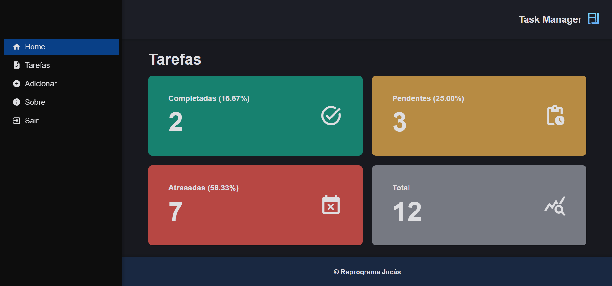

# Task Manager

Task Manager is a Full-Stack application developed in `React` and `Node.js` to complete the [Web Development Course](https://emanuelquintino.github.io/Page-WDC/) offered by `Reprograma Jucás`. It was created with the aim of providing users with a tool to manage and monitor their tasks in an organized and intuitive way.



## Features

- User registration and authentication with `JWT tokens`
- Task Management: `ADD`, `EDIT` and `DELETE` tasks
- Task history and listing tasks with `pagination`
- Statistics and `report` with totals by status
- Task `filtering` by status
- Integration with own `RESTfull API`
- Application `deployment`

## Technologies

- `React`
- `TypeScript`
- `Style Components`
- `React Router DOM`
- `React Hook Form`
- `React Tanstack Query`
- `Axios`

## Project Configuration

```bash
# clone the repository
$ git clone https://github.com/EmanuelQuintino/Task-Manager.git

# install dependencies
$ npm install

# run the project
$ npm run dev
```

## Environment Variables

```ini
VITE_API=""
VITE_STORAGE_USERID_KEY=""
```

## Links

- [Deploy](https://task-manager-seven-indol.vercel.app/)
- [API Repository](https://github.com/EmanuelQuintino/Task-Manager-API)
